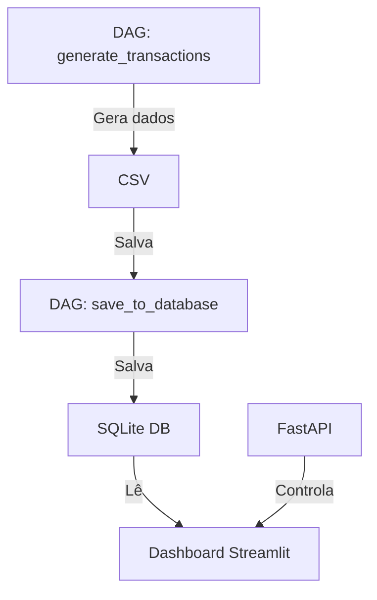

# Dashboard de Transações Bancárias

[](https://www.python.org/downloads/)
[](https://fastapi.tiangolo.com/)
[](https://streamlit.io/)
[](https://plotly.com/)
[](https://pandas.pydata.org/)
[](https://www.sqlite.org/)
[](https://airflow.apache.org/)

## Fluxo do Projeto



## Pré-requisitos

- Python 3.11 ou superior
- Astro CLI (para gerenciar o ambiente Airflow)
- `uv` (gerenciador de pacotes Python)

## Instalação

1. Clone o repositório:
```bash
git clone https://github.com/seu-usuario/learn_or_skip_airflow.git
cd learn_or_skip_airflow
```

2. Instale as dependências usando `uv`:
```bash
# Crie uma venv
uv venv

# Ative a venv (Mac)
source .venv/bin/activate

# Gera o requirements.txt a partir do pyproject.toml
uv pip compile pyproject.toml -o requirements.txt

# Instala as dependências do requirements.txt
uv pip install -r requirements.txt
```

3. Inicie o ambiente Airflow através do astro-cli:
```bash
astro dev start
```


4. Inicie a API FastAPI:
```bash
uv run python main.py
```

5. Acesse o dashboard através da API:
- Abra o navegador em `http://localhost:8000`
- Use o endpoint `/start-dashboard` para iniciar o dashboard
- Acesse o dashboard em `http://localhost:8501`


## Estrutura do Projeto

```
learn_or_skip_airflow/
├── dags/                    # DAGs do Airflow
│   ├── generate_transactions_dag.py
│   └── save_to_database_dag.py
├── src/                     # Código fonte
│   ├── dashboard/          # Dashboard Streamlit
│   │   └── app.py
│   ├── database/          # Gerenciamento do banco de dados
│   │   └── db_manager.py
│   └── data_generators/   # Geradores de dados
│       └── bank_transaction_generator.py
├── data/                   # Dados gerados
├── main.py                 # API FastAPI
└── pyproject.toml         # Dependências do projeto
```

## Funcionalidades

- **Dashboard**: Visualização interativa de transações bancárias
- **DAGs**: Automação da geração e armazenamento de dados
- **API**: Gerenciamento do dashboard via endpoints REST

## Desenvolvimento

Para desenvolvimento local, você pode executar os scripts diretamente:

```bash
# Gerar dados
python src/generate_transactions.py

# Salvar no banco
python src/save_to_database.py

# Executar dashboard
streamlit run src/dashboard/app.py
```

## Comandos Úteis do Airflow

```bash
# Iniciar ambiente
astro dev start

# Parar ambiente
astro dev stop

# Reiniciar ambiente
astro dev restart

# Ver logs
astro dev logs
```

## Documentação da API

A documentação da API está disponível em:
- Swagger UI: `http://localhost:8000/docs`
- ReDoc: `http://localhost:8000/redoc`

## Contribuindo

1. Faça um fork do projeto
2. Crie uma branch para sua feature (`git checkout -b feature/AmazingFeature`)
3. Commit suas mudanças (`git commit -m 'Add some AmazingFeature'`)
4. Push para a branch (`git push origin feature/AmazingFeature`)
5. Abra um Pull Request 
