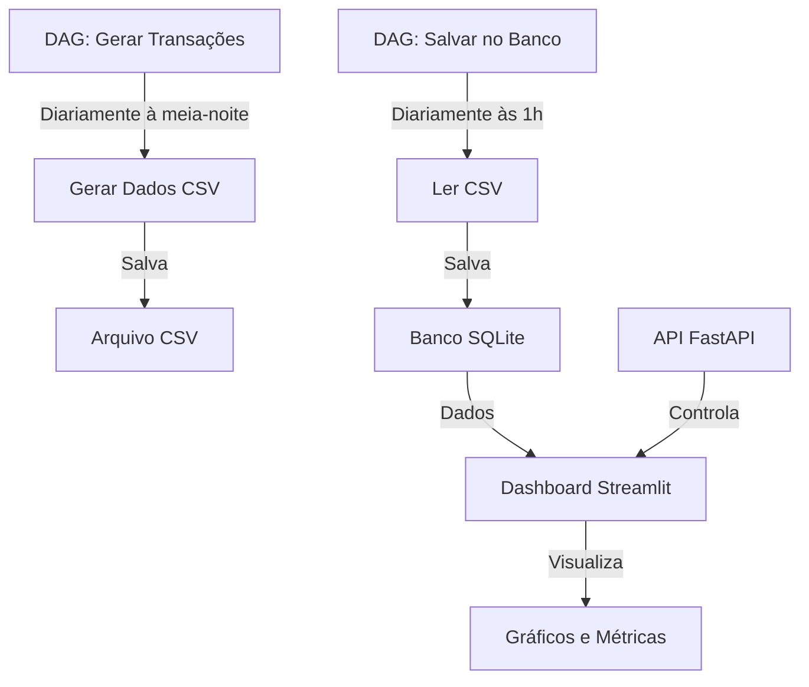

# Learn or Skip Airflow

[](https://www.python.org/downloads/)
[](https://fastapi.tiangolo.com/)
[](https://streamlit.io/)
[](https://plotly.com/)
[](https://pandas.pydata.org/)
[](https://www.sqlite.org/)
[](https://airflow.apache.org/)

Aplicação web para ajudar a decidir se vale a pena aprender Apache Airflow.

## Fluxo do Projeto



## Pré-requisitos

- Python 3.8+
- Node.js 18+
- [uv](https://github.com/astral-sh/uv) - Gerenciador de pacotes Python mais rápido
- [Astro CLI](https://docs.astronomer.io/astro/cli/install-cli) - CLI do Astronomer

## Instalação

1. Clone o repositório:
```bash
git clone https://github.com/seu-usuario/learn-or-skip-airflow.git
cd learn-or-skip-airflow
```

2. Inicialize o ambiente virtual Python com uv:
```bash
uv init
uv venv
source .venv/bin/activate  # No Linux/Mac
# ou
.venv\Scripts\activate  # No Windows
```

3. Instale as dependências:
```bash
uv add pandas==2.2.1
uv add streamlit==1.32.2
uv add plotly==5.19.0
uv add numpy==1.26.4
uv add python-dateutil==2.8.2
uv add pytz==2024.1
uv add typing-extensions==4.9.0
uv add tenacity==8.2.3
uv add rich==13.7.0
uv add click==8.1.7
uv add watchdog==4.0.0
uv add altair==5.2.0
uv add toolz==0.12.1
uv add fastapi==0.110.0
uv add uvicorn==0.27.1
```

## Iniciando o Projeto

### 1. Iniciar o Ambiente Airflow

```bash
# Inicia o ambiente Airflow local
astro dev start

# Aguarde até que todos os serviços estejam prontos
# O Airflow estará disponível em http://localhost:8080
# Credenciais padrão: admin/admin
```

### 2. Iniciar a API FastAPI

```bash
python main.py
```

A API estará disponível em `http://localhost:8000`

### 3. Gerenciar o Dashboard

Use os seguintes endpoints da API:

- **Iniciar o Dashboard**:
```bash
curl -X POST http://localhost:8000/start-dashboard
```

- **Parar o Dashboard**:
```bash
curl -X POST http://localhost:8000/stop-dashboard
```

- **Verificar Status**:
```bash
curl http://localhost:8000/dashboard-status
```

### 4. Acessar o Dashboard

Após iniciar o dashboard, acesse:
- Dashboard: `http://localhost:8501`
- Documentação da API: `http://localhost:8000/docs`
- Airflow UI: `http://localhost:8080`

## Estrutura do Projeto

```
.
├── dags/
│   ├── generate_transactions_dag.py
│   └── save_to_database_dag.py
├── src/
│   ├── data_generators/
│   │   └── bank_transaction_generator.py
│   ├── database/
│   │   └── db_manager.py
│   ├── dashboard/
│   │   └── app.py
│   ├── models/
│   │   └── transaction.py
│   └── utils/
│       └── constants.py
├── main.py
└── README.md
```

## Funcionalidades

### Dashboard
- Filtro por período de datas
- Métricas principais (total, valor médio, etc.)
- Gráficos interativos:
  - Linha temporal de transações
  - Distribuição por categoria
  - Total por tipo de transação
- Tabela detalhada de transações

### DAGs
- Geração diária de dados
- Armazenamento automático no banco
- Tratamento de erros e retries

### API
- Gerenciamento do dashboard
- Status em tempo real
- Documentação automática (Swagger/ReDoc)

## Desenvolvimento

### Gerar Dados Manualmente
```bash
python src/generate_bank_transactions.py
```

### Salvar no Banco
```bash
python src/save_to_database.py
```

### Executar Dashboard Diretamente
```bash
streamlit run src/dashboard/app.py
```

### Comandos Úteis do Airflow

```bash
# Iniciar o ambiente Airflow
astro dev start

# Parar o ambiente Airflow
astro dev stop

# Reiniciar o ambiente Airflow
astro dev restart

# Ver logs
astro dev logs
```

## Licença

MIT
